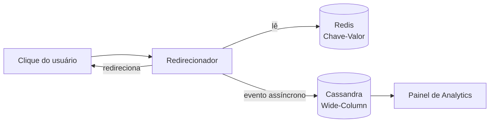

# LinkPulse

Encurtador de URLs voltado para equipes de marketing digital que divulgam a mesma campanha em vários canais e precisam acompanhar, quase em tempo real, o desempenho de cada link individualmente.

> Projeto incremental da disciplina Bancos de Dados NoSQL — CEUB, Campus Asa Norte.
> Integrantes: Eduardo Manzur, Gabriel Becker, Guilherme Rocha, Guilherme Vieira.

## Por que existe

Encurtadores genéricos resolvem o redirecionamento, mas não o problema real de um time de marketing: saber **qual canal está performando**, com o link disponível mesmo sob pico de tráfego de campanha. Detalhes em [VISAO](docs/produto/VISAO.md).

## Como funciona (visão rápida)

- **Redis (Chave-Valor):** mapeamento `short_code → URL` e contador de cliques em tempo real — caminho crítico de latência.
- **Cassandra (Wide-Column):** histórico de cliques, modelado em torno da consulta mais frequente do negócio ("cliques deste link em um período").

Justificativa completa em [ARQUITETURA](docs/arquitetura/ARQUITETURA.md); fluxos em [FUNCIONALIDADES](docs/arquitetura/FUNCIONALIDADES.md); requisitos com critério verificável em [REQUISITOS](docs/requisitos/REQUISITOS.md).

## Estado atual

- Documentação do Marco 1 (modelagem e justificativa) pronta; checklist da disciplina em [DISCIPLINA](docs/produto/DISCIPLINA.md).
- O Marco 1 entrega só a documentação exigida pela disciplina ([ADR-0011](docs/decisoes/ADR-0011-marco-1-so-documentacao.md)). A aplicação é do Marco 2, em Python + FastAPI com Redis e Cassandra via Docker Compose ([ADR-0010](docs/decisoes/ADR-0010-stack-da-aplicacao.md)).
- Decisões pendentes em [QUESTOES](docs/requisitos/QUESTOES.md).

## Documentação

| Onde | O que tem |
| --- | --- |
| [docs/](docs/README.md) | Índice geral da documentação |
| [docs/produto/](docs/produto/README.md) | Visão, pitch e regras da disciplina |
| [docs/arquitetura/](docs/arquitetura/README.md) | Modelagem de dados e fluxos |
| [docs/requisitos/](docs/requisitos/README.md) | Requisitos (RF, RNF, RN) e questões |
| [docs/decisoes/](docs/decisoes/README.md) | Registro de decisões (ADR) |
| [docs/specs/](docs/specs/README.md) | Especificações com plano e critérios de aceitação |
| [docs/roadmap/](docs/roadmap/README.md) | Marcos e tarefas |

## Roadmap

- **Marco 1 — Modelagem inicial:** descrição do problema, modelagem Chave-Valor + Wide-Column e justificativa técnica. Vencimento: 29/09/2026 às 00:00.
- **Marco 2 — Sistema completo:** aplicação funcional e um banco de Documentos para metadados de campanha (tags, descrição, UTM) — dado semiestruturado e mutável, complementar ao evento de clique imutável.

Tarefas e andamento em [ROADMAP](docs/roadmap/ROADMAP.md).

## Contribuindo

Regras de issues, branches, commits, PRs, revisão e merge em [CONTRIBUTING](CONTRIBUTING.md). Agentes de código seguem o [AGENTS](AGENTS.md).
