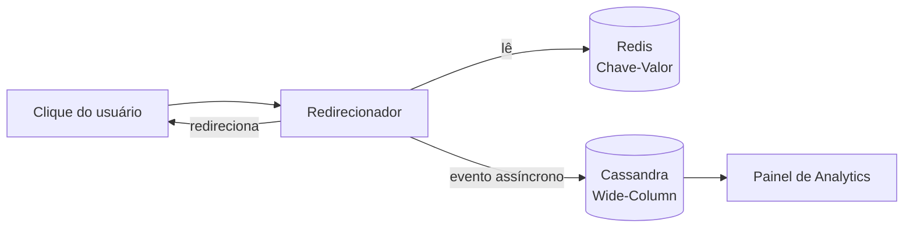

# LinkPulse

Encurtador de URLs voltado para equipes de marketing digital que divulgam a mesma campanha em vários canais e precisam acompanhar, quase em tempo real, o desempenho de cada link individualmente.

> Projeto incremental de modelagem de dados — Campus Asa Norte.
> Integrantes: Eduardo Manzur, Gabriel Becker, Guilherme Rocha, Guilherme Vieira.

## Por que existe

Encurtadores genéricos resolvem o redirecionamento, mas não o problema real de um time de marketing: saber **qual canal está performando**, com o link sempre disponível mesmo sob pico de tráfego de campanha. Detalhes em [docs/VISAO.md](docs/VISAO.md).

## Como funciona (visão rápida)

- **Redis (Chave-Valor):** mapeamento `short_code → URL` e contador de cliques em tempo real — caminho crítico de latência.
- **Cassandra (Wide-Column):** histórico de cliques, modelado em torno da consulta mais frequente do negócio ("cliques deste link em um período").

Detalhes completos das decisões de modelagem em [docs/ARQUITETURA.md](docs/ARQUITETURA.md).

## Funcionalidades (Marco 1)

- Criação de link curto com código não sequencial
- Redirecionamento de baixa latência, priorizando disponibilidade
- Registro de cada clique como evento (timestamp, dispositivo, região, referrer)
- Contador de cliques em tempo real
- Consultas de analytics: cliques por dia, por canal, por janela de tempo
- Expiração opcional de links

Diagramas de fluxo (criação, redirecionamento, analytics) em [docs/FUNCIONALIDADES.md](docs/FUNCIONALIDADES.md).

## Documentação do projeto

| Documento | Conteúdo |
| --- | --- |
| [docs/VISAO.md](docs/VISAO.md) | Problema, público-alvo e diferenciais |
| [docs/FUNCIONALIDADES.md](docs/FUNCIONALIDADES.md) | Lista de funcionalidades e diagramas de fluxo |
| [docs/ARQUITETURA.md](docs/ARQUITETURA.md) | Modelagem de dados, justificativa técnica (CAP, BASE, sharding) |
| [docs/PITCH.md](docs/PITCH.md) | Pitch do produto e diferencial competitivo |

## Roadmap

- **Marco 1 (atual):** modelagem Chave-Valor + Wide-Column para redirecionamento e histórico de cliques.
- **Marco 2:** incorporar um banco de Documentos para metadados de campanha (tags, descrição, UTM) — dado semiestruturado e mutável, complementar ao evento de clique imutável.
