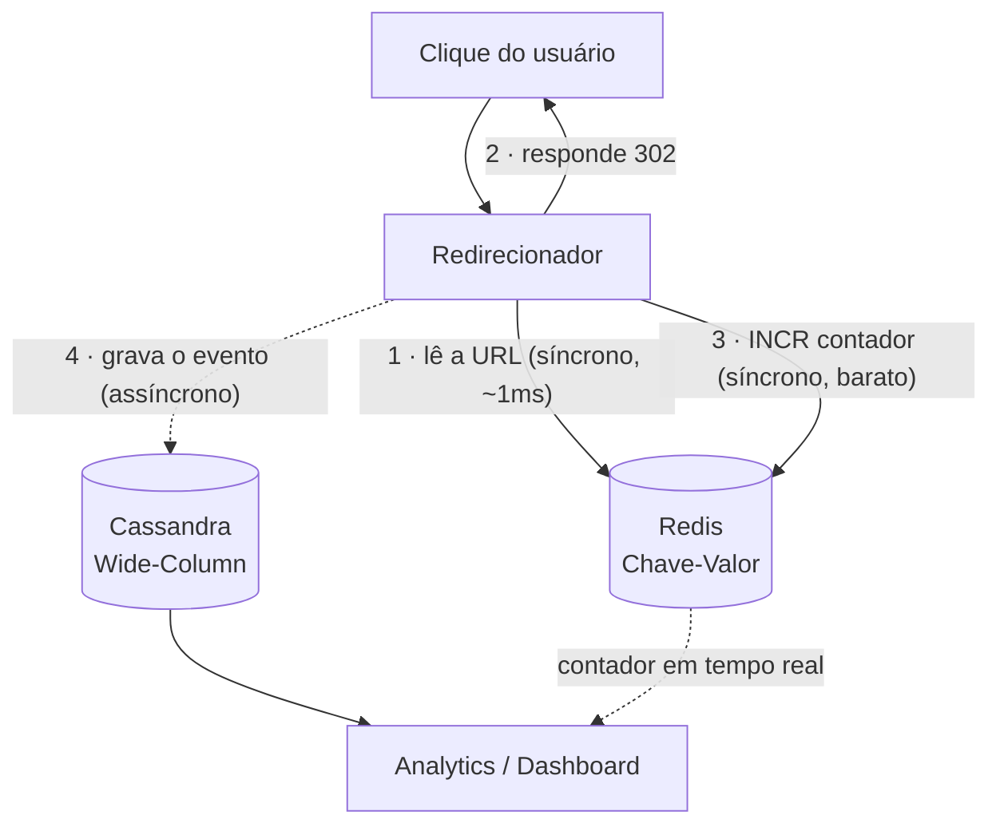
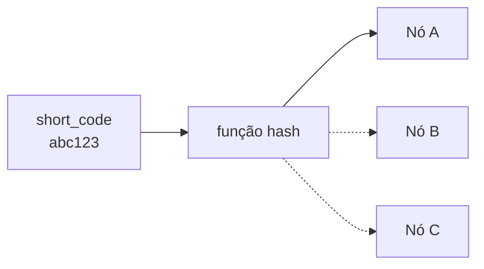

# Arquitetura e Modelagem de Dados

> Decisões técnicas do **Marco 1 (Modelagem Inicial)**. O objetivo aqui é explicar *por que* cada tecnologia foi escolhida — cada conceito é introduzido antes de ser usado, então não é necessário conhecer Redis ou Cassandra de antemão.

---

## Resumo em 30 segundos

O LinkPulse faz duas coisas muito diferentes ao mesmo tempo:

1. **Redirecionar** — responder "para onde vai o código `abc123`?" em milissegundos, milhões de vezes.
2. **Registrar e analisar cliques** — guardar cada clique como um evento e responder "como este link performou nos últimos 7 dias?".

Essas duas operações têm necessidades opostas. A primeira é uma leitura simples que **não pode ser lenta nem falhar**. A segunda é uma escrita em rajada, seguida de leituras que varrem muitos registros. Tentar atender as duas com o mesmo banco faz uma atrapalhar a outra.

Por isso o projeto usa **dois bancos, cada um com uma responsabilidade**:

| Responsabilidade                               | Tecnologia          | Família    |
| ---------------------------------------------- | ------------------- | ----------- |
| Redirecionar (código → URL) e contar cliques | **Redis**     | Chave-Valor |
| Guardar o histórico de cliques para analytics | **Cassandra** | Wide-Column |

---

## Passo 1 — Quais perguntas o sistema precisa responder

Em um banco relacional, o processo normal é modelar as **entidades** primeiro (Link, Clique, Cliente) e depois escrever as consultas. Em NoSQL o processo é invertido: começamos pelas **consultas** e modelamos os dados para servi-las. Isso se chama **modelagem query-first**.

As operações do LinkPulse, em ordem de frequência:

| # | Operação                                    | Frequência              | Tolera lentidão?    | Tolera falha?                 |
| - | --------------------------------------------- | ------------------------ | -------------------- | ----------------------------- |
| 1 | "Para onde o código `abc123` redireciona?"  | Altíssima (todo clique) | ❌ Não              | ❌ Não                       |
| 2 | "Registre que houve um clique agora"          | Altíssima (todo clique) | ✅ Sim (assíncrono) | ⚠️ Perda pontual aceitável |
| 3 | "Quantos cliques o link `abc123` tem agora?" | Alta (dashboard aberto)  | ✅ Sim (segundos)    | ✅ Sim                        |
| 4 | "Cliques do link `abc123` entre duas datas"  | Média (análise)        | ✅ Sim (segundos)    | ✅ Sim                        |
| 5 | "Crie um link curto para esta URL"            | Baixa                    | ✅ Sim               | ❌ Não                       |

As operações 1 e 2 acontecem **no mesmo instante** — o clique do usuário dispara as duas. Essa é a tensão central do sistema, e toda a arquitetura existe para resolvê-la.

---

## Passo 2 — Por que não um banco relacional único

Um PostgreSQL resolveria isso? Tecnicamente sim, até certo ponto. Três problemas aparecem conforme o volume cresce:

### Problema 1 — Agregações competem com escritas pelo mesmo disco

Imagine a tabela `cliques` com 50 milhões de linhas. O time de marketing abre o dashboard e o sistema executa:

```sql
SELECT DATE(clicado_em), COUNT(*)
FROM cliques
WHERE short_code = 'abc123'
GROUP BY DATE(clicado_em);
```

Essa consulta precisa varrer muitas linhas. Enquanto ela roda, **novos cliques continuam chegando** e disputam o mesmo I/O de disco. O resultado é que o dashboard fica lento e, pior, o registro de cliques também. Quanto mais o time usa o produto, mais lento o produto fica.

### Problema 2 — Picos imprevisíveis exigem escala horizontal

Um sistema administrativo tem carga previsível: mais acessos das 9h às 18h. Uma campanha de marketing não. Um post pode viralizar às 3h da manhã de um domingo e gerar 500 cliques por minuto em um único link.

Escalar um relacional tradicional significa principalmente **escala vertical** — uma máquina maior. Isso tem teto e custo fixo alto. Precisamos de **escala horizontal**: adicionar nós conforme a demanda, algo que Redis e Cassandra fazem nativamente.

### Problema 3 — A flexibilidade do relacional não é usada

O modelo relacional é genérico de propósito: tabelas normalizadas e joins permitem fazer *qualquer* consulta, inclusive as que não foram previstas. Mas nós já sabemos, desde o design, quais são as duas consultas que dominam o sistema (operações 1 e 4 da tabela acima). Pagamos o custo da flexibilidade sem usar o benefício.

> **Importante:** isso não é uma crítica a bancos relacionais. Se o produto precisasse de transações financeiras, relatórios ad-hoc ou integridade referencial forte, o relacional seria a escolha certa. A conclusão vale para *este* padrão de acesso.

---

## Passo 3 — A solução: dois bancos, duas responsabilidades



O ponto central desse desenho: **o usuário não espera pela escrita no Cassandra**. A linha tracejada (passo 4) acontece depois que o `302` já foi enviado. Mesmo que o Cassandra esteja sob pico de escrita, a latência percebida por quem clicou não muda.

---

## Passo 4 — Chave-Valor (Redis): o caminho crítico

### O que é um banco Chave-Valor

É o modelo de dados mais simples possível: uma chave única aponta para um valor. Não há tabelas, colunas ou joins — a única forma de buscar um dado é pela chave exata. Em troca dessa limitação, a leitura é extremamente rápida (o Redis mantém tudo em memória).

Isso encaixa perfeitamente com a operação 1: temos o `short_code` em mãos e queremos a URL. **Nunca** precisamos perguntar "quais links contêm a palavra natal?" no caminho crítico.

### Estrutura 1 — Hash com os dados do link

Um **Hash** do Redis permite guardar vários campos sob uma única chave, como um pequeno registro. Assim, uma única operação (`HGETALL`) traz tudo que o redirecionador precisa:

```
Chave: link:abc123
┌──────────────┬────────────────────────────────────────────┐
│ url          │ "https://exemplo.com/campanha-natal"       │
│ cliente_id   │ 8842                                       │
│ criado_em    │ 2026-09-10T14:00:00Z                       │
│ expira_em    │ 2026-12-25T23:59:59Z   (opcional)          │
└──────────────┴────────────────────────────────────────────┘
```

Por que um Hash e não uma string simples com a URL? Porque o redirecionador precisa checar `expira_em` antes de redirecionar. Guardando tudo junto, isso custa **uma** ida ao banco em vez de duas.

### Estrutura 2 — Contador de cliques

```
contador:abc123  ->  INCR   (incrementa em 1, de forma atômica)
```

`INCR` é uma operação atômica: mesmo que 500 cliques cheguem no mesmo segundo vindos de nós diferentes, nenhum é perdido por condição de corrida. É o que alimenta o número "cliques agora" do dashboard sem precisar contar linha por linha no Cassandra.

Esse contador é **soft state**: se o Redis perder o valor, ele pode ser recalculado a partir do histórico no Cassandra. É um cache de performance, não a fonte da verdade.

---

## Passo 5 — Wide-Column (Cassandra): o histórico de cliques

### O que é um banco Wide-Column

Wide-Column parece SQL à primeira vista (tem tabelas e colunas, e a linguagem CQL lembra SQL), mas a semelhança é superficial. A diferença que importa: **a chave primária define fisicamente onde e como os dados são gravados no cluster**, e você só consegue consultar de forma eficiente seguindo essa estrutura.

A chave primária tem duas partes:

- **Partition key** — decide **em qual nó** do cluster o dado fica.
- **Clustering column** — decide **em que ordem** os dados ficam gravados dentro daquele nó.

### A tabela

```sql
CREATE TABLE cliques_por_link (
  short_code   text,        -- partition key: em qual nó fica
  clicado_em   timestamp,   -- clustering column: em que ordem fica
  pais         text,
  dispositivo  text,
  referrer     text,
  PRIMARY KEY (short_code, clicado_em)
) WITH CLUSTERING ORDER BY (clicado_em DESC);
```

Repare no nome: `cliques_por_link`, não `cliques`. Em Wide-Column, é comum a tabela ser nomeada pela **consulta que ela serve**. Se precisássemos de "cliques por país", criaríamos outra tabela com os mesmos dados organizados de outro jeito — duplicação de dados é normal e esperada aqui.

### Como os dados ficam fisicamente

```
Nó A                                    Nó B
┌────────────────────────────┐          ┌────────────────────────────┐
│ Partição: abc123           │          │ Partição: xyz789           │
│  10:32:07 · BR · mobile    │ ← mais   │  09:15:02 · PT · desktop   │
│  10:32:05 · BR · mobile    │   recente│  08:44:55 · BR · mobile    │
│  10:31:58 · US · desktop   │          │  08:02:13 · BR · tablet    │
│  10:29:44 · BR · tablet    │ ← mais   │  ...                       │
│  ...                       │   antigo │                            │
└────────────────────────────┘          └────────────────────────────┘
```

Todos os cliques de um mesmo link ficam **juntos, no mesmo nó, já ordenados do mais recente para o mais antigo**. Isso significa que a consulta mais comum do dashboard:

```sql
SELECT * FROM cliques_por_link
WHERE short_code = 'abc123'
  AND clicado_em >= '2026-09-09';
```

não faz busca nem ordenação: o Cassandra vai direto ao nó certo e lê uma sequência contígua de registros. É a diferença entre procurar um livro numa estante organizada e revirar uma caixa.

O `CLUSTERING ORDER BY (clicado_em DESC)` é o que garante que os cliques mais recentes estejam no início — exatamente o que o painel pergunta com mais frequência ("como este link está performando **agora**").

---

## Passo 6 — Decisões de sistemas distribuídos

### Teorema CAP: escolhemos AP (Disponibilidade)

O teorema CAP diz que, **quando há uma falha de rede entre os nós** (partição), um sistema distribuído precisa escolher entre:

- **CP** — Consistência: recusar a resposta se não puder garantir que ela é a mais atual.
- **AP** — Disponibilidade: responder de qualquer jeito, mesmo que o dado esteja alguns instantes desatualizado.

O LinkPulse escolhe **AP** nas duas partes. O raciocínio:

> Um redirecionamento que **falha** é pior do que um redirecionamento servido por um nó momentaneamente desatualizado. O link é a promessa feita a quem clicou no anúncio — e o anúncio já foi pago.

Na prática: se um nó ainda não recebeu a atualização de uma URL editada há 2 segundos, ele redireciona para o destino antigo. O usuário chega em algum lugar válido. Se escolhêssemos CP, ele veria um erro — e o clique pago viraria prejuízo.

O mesmo vale para o analytics: o dashboard não precisa refletir o último milissegundo, só precisa ser **eventualmente** preciso.

### ACID vs. BASE: seguimos BASE

|          | ACID (relacional)                               | BASE (NoSQL distribuído)                 |
| -------- | ----------------------------------------------- | ----------------------------------------- |
| Garantia | Toda leitura vê o dado mais recente            | Consistência **eventual**           |
| Preço   | Coordenação entre nós, menor disponibilidade | Menos coordenação, mais disponibilidade |

O LinkPulse segue **BASE**:

- **Basically Available** — o redirecionamento responde mesmo com nós fora do ar.
- **Soft state** — o contador de cliques pode divergir temporariamente; ele é recalculável a partir do histórico.
- **Eventually consistent** — as réplicas convergem em segundos, o que é suficiente para um painel de analytics.

Não há transação financeira neste escopo. Se houvesse cobrança por clique, a conclusão seria outra.

### Sharding: particionamento hash-based por `short_code`

**Sharding** é dividir os dados entre vários nós para que nenhum sozinho aguente toda a carga. O Cassandra faz isso aplicando uma função hash na partition key para decidir o nó de destino.

Aqui há uma conexão sutil com uma decisão de produto: **o `short_code` é gerado de forma não sequencial**. Isso foi decidido originalmente por segurança (evitar que alguém adivinhe links enumerando `aaa1`, `aaa2`, `aaa3`), mas tem um efeito colateral valioso na infraestrutura.

Se os códigos fossem sequenciais, links criados na mesma campanha cairiam em partições próximas e o tráfego se concentraria em poucos nós — um **hotspot**, onde um nó fica sobrecarregado enquanto os outros ficam ociosos. Com códigos aleatórios, a distribuição entre nós tende a ser uniforme naturalmente.



### Replicação: Master-Slave

O volume de **leitura** (redirecionamentos + consultas do dashboard) é ordens de magnitude maior que o de **escrita** (criação de link + registro de clique). A replicação Master-Slave se encaixa nesse desequilíbrio: as escritas vão para o master, e as leituras são distribuídas entre várias réplicas, que podem ser adicionadas conforme o tráfego cresce.

---

## Trade-offs assumidos conscientemente

Nenhuma arquitetura é só benefício. O que aceitamos em troca:

| Trade-off                                                                             | Por que é aceitável aqui                                            |
| ------------------------------------------------------------------------------------- | --------------------------------------------------------------------- |
| O dashboard pode mostrar um número alguns segundos defasado                          | Decisões de marketing não mudam por 3 segundos de defasagem         |
| Consultas não previstas ("todos os cliques de tablets no Brasil") exigem nova tabela | O conjunto de consultas do produto é conhecido e estável            |
| Dois bancos = mais complexidade operacional                                           | Cada um faz uma coisa bem; um só faria as duas mal sob pico          |
| Um clique pode ser perdido se o nó cair antes da escrita assíncrona                 | Perda pontual não altera tendências; o contador Redis já registrou |

---

## Estimativa de volume (cenário assumido)

- ~150 clientes no primeiro semestre de operação
- ~300 links ativos por cliente → **~45.000 links ativos**
- Picos de campanha: até **~500 cliques/minuto** em um único link durante um lançamento viral

O número que importa não é a média, e sim o **pico concentrado em uma única partição** — é ele que define se a modelagem aguenta ou não.

---

## Mapeamento com o conteúdo da disciplina

| Unidade                                            | Conceito aplicado                                                                                    | Onde está neste documento |
| -------------------------------------------------- | ---------------------------------------------------------------------------------------------------- | -------------------------- |
| Unidade 1 — Fundamentos de sistemas distribuídos | Limites do relacional, Teorema CAP (AP), modelo BASE, sharding hash-based, replicação Master-Slave | Passos 2 e 6               |
| Unidade 2 — Chave-Valor                           | Hash do Redis para os atributos do link; contador via `INCR` para a métrica em tempo real          | Passo 4                    |
| Unidade 3 — Wide-Column                           | Modelagem *query-first*; partition key e clustering column coerentes com o padrão de acesso        | Passos 1 e 5               |

---

## Próximo passo (preview do Marco 2)

O grupo pretende incorporar um banco de **Documentos** para os metadados de campanha (tags, descrição, configurações de UTM).

A justificativa segue a mesma lógica dos passos anteriores: esse dado é **semiestruturado e mutável** (cada campanha tem um conjunto diferente de tags, e elas mudam ao longo do tempo), o oposto do evento de clique, que é **rígido e imutável** (um clique que aconteceu nunca muda). São naturezas diferentes o bastante para justificarem modelos diferentes — que é exatamente o tipo de decisão que este documento vem registrando.

> Banco de Documentos é conteúdo das próximas unidades da disciplina e **não faz parte da justificativa do Marco 1** — está registrado aqui apenas como direção pretendida.
