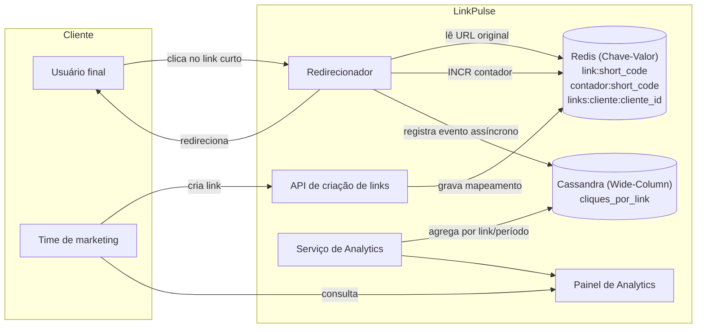
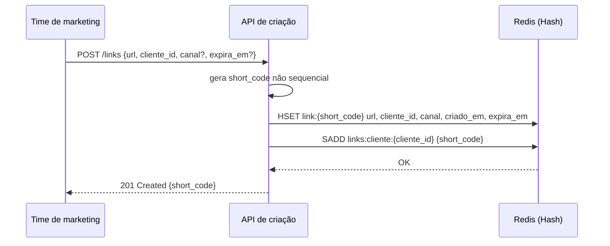
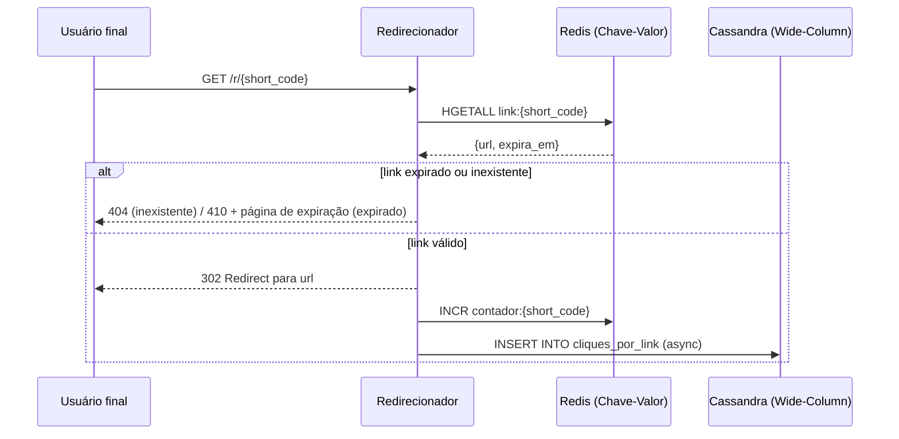
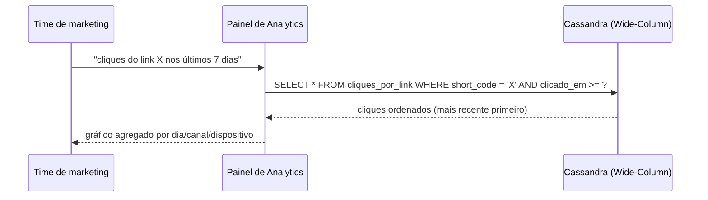

# Funcionalidades

## Lista de funcionalidades (Marco 1)

- **Criação de link curto.** Gera um código não sequencial a partir de uma URL longa, evitando previsibilidade. Cada canal de divulgação ganha o seu próprio link, identificado por um nome de canal opcional.
- **Redirecionamento de baixa latência.** Resolve `short_code → URL original` com prioridade em disponibilidade, mesmo sob pico de tráfego.
- **Registro de cliques como eventos.** Cada clique grava timestamp, dispositivo, país/região e referrer.
- **Contador de cliques em tempo real.** Métrica agregada disponível instantaneamente, sem depender de varredura do histórico completo.
- **Consultas de analytics pré-definidas.** Cliques por link/dia, cliques por canal, total de cliques em uma janela de tempo.
- **Expiração opcional de links.** Suporte a campanhas sazonais e promoções com prazo definido.

## Arquitetura geral

## Fluxo: criação de link

## Fluxo: redirecionamento (caminho crítico de latência)

O redirecionamento em si (linhas 1–3 e o `302`) não espera a escrita do histórico de cliques — ela é assíncrona, para que um pico de escrita no Wide-Column nunca aumente a latência percebida pelo usuário final.

## Fluxo: consulta de analytics

## Funcionalidades futuras (preview do Marco 2)

- Metadados de campanha (tags, descrição, UTM) em um banco de **Documentos**, permitindo enriquecer o link sem impactar o modelo de eventos imutáveis do histórico de cliques.
